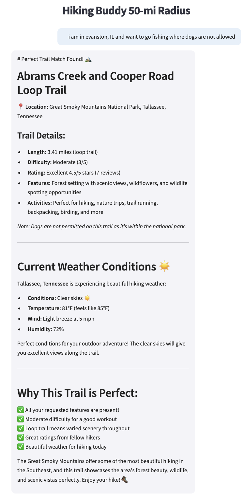
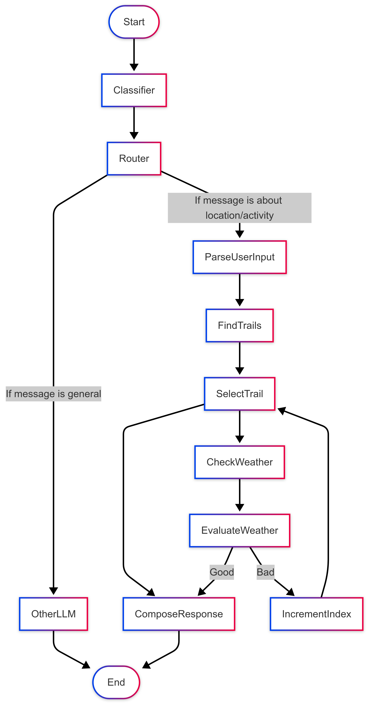

# Trail & Weather Chatbot 🌲

## Visual Examples

### Streamlit Assistant Response


*Example of the chatbot's response in the Streamlit web UI.*

### LangGraph Conversation Flow


*Graph structure of the conversation pipeline implemented with LangGraph.*

## Project Description
This project is an intelligent chatbot that helps users discover the best outdoor trails based on their location, preferred activities, and desired trail features, while also considering real-time weather conditions. By integrating trail data, Google Maps, and weather APIs, the chatbot provides personalized recommendations for outdoor adventures, ensuring both suitability and safety.

## Goal
The main goal is to assist users in finding the most suitable trails for their outdoor activities, factoring in:
- Proximity to the user's location
- Supported activities (e.g., hiking, biking, birding)
- Desired features (e.g., waterfalls, lakes, dog-friendly)
- Current weather conditions at the trailhead

## Pipeline Overview
The chatbot follows a multi-step pipeline:
1. **Parse User Input**: Extracts the user's location, activities, and desired features from natural language input.
2. **Find Trails**: Retrieves and filters nearby trails using a trail database and Google Maps for distance calculations.
3. **Rank & Select Trail**: Ranks trails based on best match for user preferences and proximity.
4. **Check Weather**: Fetches real-time weather data for the selected trail.
5. **Evaluate Weather**: Determines if the weather is suitable for the intended activity.
6. **Compose Response**: Crafts a friendly, informative reply with the best match and alternative suggestions.

## Graph Structure
The core logic is implemented as a directed graph using [LangGraph](https://github.com/langchain-ai/langgraph), where each node represents a step in the conversation flow:


- **Classifier**: Determines if the message should be parsed for trail search or handled as a general query.
- **Router**: Directs the flow based on message type.
- **ParseUserInput**: Extracts structured data from user input.
- **FindTrails**: Retrieves and ranks trails.
- **SelectTrail**: Picks the best candidate.
- **CheckWeather**: Gets weather for the trail.
- **EvaluateWeather**: Decides if the weather is suitable.
- **IncrementIndex**: Moves to the next trail if needed.
- **ComposeResponse**: Generates the final reply.

## Techniques Used
- **Natural Language Understanding**: Uses LLMs (Anthropic Claude) to parse user intent and classify messages.
- **Data Integration**: Combines trail data, Google Maps API (for geocoding and distance), and OpenWeather API.
- **LLM-based DataFrame Agent**: Uses LangChain's `create_pandas_dataframe_agent` to rank and select trails based on user preferences and proximity.
- **Conversational Graph**: Implements a stateful, multi-step conversation using LangGraph.
- **Pandas DataFrame Manipulation**: For efficient trail filtering and ranking.

## Tech Stack
- **Python 3.10+**
- **Streamlit**: For the interactive web UI
- **LangGraph**: For graph-based conversational flow
- **LangChain**: For LLM orchestration and DataFrame agent
- **Anthropic Claude**: For language understanding and response generation
- **Google Maps API**: For geocoding and distance calculations
- **OpenWeather API**: For real-time weather data
- **Pydantic**: For data validation

## Applications & Use Cases
- **Outdoor Enthusiasts**: Find the best trails for hiking, biking, birding, and more, tailored to current weather.
- **Trip Planning**: Plan safe and enjoyable outdoor activities based on real-time conditions.
- **Accessibility**: Discover trails with specific features (e.g., ADA accessible, dog-friendly, kid-friendly).
- **Conversational Assistant**: Integrate as a chatbot in web or mobile apps for personalized outdoor recommendations.

## How to Run
1. Install dependencies:
   ```bash
   pip install -r requirements.txt
   ```
2. Set up your `.env` file with your API keys:
   ```env
   OPENWEATHER_API_KEY=your_openweather_key
   GOOGLE_API_KEY=your_google_maps_key
   ```
3. Run the Streamlit app:
   ```bash
   streamlit run st_app.py
   ```

## Example Conversation
```
User: I'm in Boston, MA and want to go hiking and see a waterfall.
Assistant: [Recommends best trail, provides weather, and suggests alternatives.]
```

---

For more details, see the code in `trail_weather_graph.py` and the Streamlit UI in `st_app.py`.
